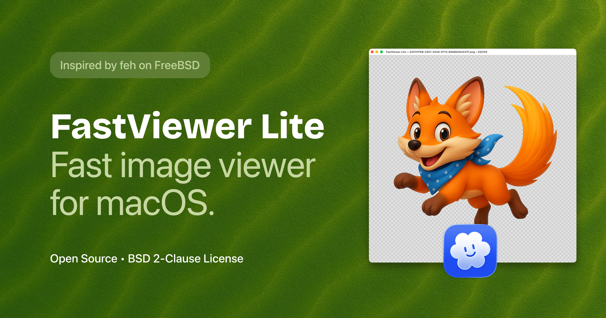
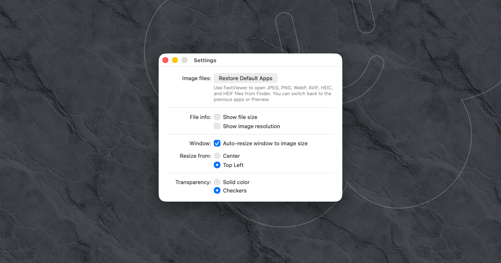

# FastViewer Lite

FastViewer Lite is a lightweight native image viewer for macOS. It opens common image formats quickly and supports drag-and-drop, folder navigation, zooming and panning, image metadata, transparency previews, and common file actions.

## Requirements

- macOS 12.0 (Monterey) or later
- Xcode with Swift 5 support

## Build and test

Open `FastViewerLite.xcodeproj` in Xcode, select the **FastViewer Lite** scheme, and choose **Run**. The test suite is available through **Product > Test**.

## License

FastViewer Lite is released under the BSD 2-Clause License. See [LICENSE](LICENSE) for the full text.
